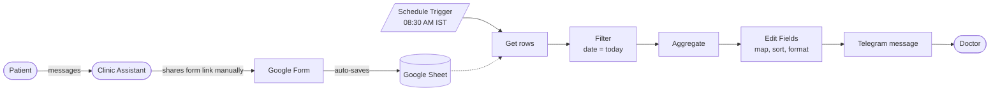

<div align="center">

# 🩺 Doctor Daily Patient List

### Appointment automation that delivers today's patients to the doctor's Telegram, every morning at 8:30 AM

<p>
  
  
  
</p>
<p>
  
  
  
  
</p>


<sub>Illustration: the shift from manual tracking to an automated workflow.</sub>

[Overview](#overview) •
[Architecture](#architecture) •
[Workflow](#workflow) •
[Output](#output) •
[Setup](#setup) •
[Roadmap](#roadmap)

</div>

---

<a id="overview"></a>

## 📌 Overview

A doctor's clinic was handling appointment requests over WhatsApp and tracking patients by hand. Every morning meant scrolling through chats and working out who was booked, for which slot, and on which number.

This project replaces that routine with a small, reliable pipeline:

> **Google Form** → **Google Sheet** → **n8n** → **Telegram**

The clinic assistant only shares a booking form link. From that point on, everything is automatic, and the doctor receives a clean, slot-sorted list of **today's patients at 8:30 AM IST** without opening a single chat.

### ✨ At a glance

| | |
|---|---|
| **Trigger** | Daily schedule, 08:30 AM (Asia/Kolkata) |
| **Input** | Google Form responses stored in Google Sheets |
| **Processing** | Filter by today's date, map to slots, sort, format |
| **Output** | One formatted Telegram message to the doctor |
| **Manual effort** | Only sharing the form link with a patient |
| **Hosting** | Self-managed n8n server with HTTPS, running 24/7 |

---

## 🎯 Problem and Solution

<table>
<tr>
<th width="50%">❌ Before</th>
<th width="50%">✅ After</th>
</tr>
<tr>
<td>

- Bookings scattered across WhatsApp chats
- Doctor scrolls messages every morning
- Names, slots, and numbers noted manually
- Easy to miss or mix up a patient
- Time taken away from patient care

</td>
<td>

- Bookings captured in one Google Sheet
- List arrives on Telegram automatically
- Patients sorted by time slot
- Accurate and consistent every day
- Zero manual tracking

</td>
</tr>
</table>

> 💡 **Design choice:** Calendar-based approaches assume patients and clinic staff already work with calendar invites. A form-and-sheet flow is simpler for everyone, so the booking step stays familiar while the daily tracking becomes fully automated.

---

<a id="architecture"></a>

## 🏗 Architecture

<p align="center">
  
</p>

<details>
<summary><b>📋 Text version of the flow (click to expand)</b></summary>



</details>

---

<a id="workflow"></a>

## ⚙️ The n8n Workflow

<p align="center">
  
</p>

| # | Node | Role |
|:-:|------|------|
| 1 | **Schedule Trigger** | Starts the workflow every day at 08:30 |
| 2 | **Get row(s) in sheet** | Reads all form responses from Google Sheets |
| 3 | **Filter** | Keeps only rows where `Appointment Date` equals today |
| 4 | **Aggregate** | Combines the filtered rows into one list |
| 5 | **Edit Fields** | Maps slots to short labels, sorts patients, builds the message text |
| 6 | **Send a text message** | Delivers the final message to the doctor via Telegram |

### 🕘 Slot mapping

The `Edit Fields` node converts the slot text from the form into a short label and a sort order.

| Slot text contains | Label | Sort order |
|---|---|:-:|
| `9 AM` | Slot I | 1 |
| `2 PM` | Slot II | 2 |
| `6 PM` | Slot III | 3 |
| anything else | original text | 4 |

> Different clinic timings? Edit the slot conditions inside the `Edit Fields` node.

---

<a id="output"></a>

## 📱 The Output

<table>
<tr>
<td width="55%" valign="top">

### What the doctor receives

Every morning at 8:30 AM:

```text
Today's Patients

1. Sam - Slot I - 87654xxxxx
2. David - Slot II - 65432xxxxx
3. Jennifer - Slot II - 70011xxxxx
4. Max - Slot III - 99887xxxxx

This message was sent automatically
with n8n
```

- Sorted by slot, so the day's order is clear at a glance
- Name, slot, and contact number in one line
- No app switching, no searching

<sub>Names and numbers shown here are dummy data.</sub>

</td>
<td width="45%" align="center">


</td>
</tr>
</table>

---

## 🧰 Tech Stack

| Layer | Tool |
|---|---|
| Automation engine | **n8n** (self-hosted, HTTPS, 24/7) |
| Data collection | **Google Forms** |
| Data storage | **Google Sheets** |
| Notification | **Telegram Bot API** |
| Logic | **JavaScript** expressions inside n8n |

### 🎓 Skills demonstrated

- Designing an end-to-end automation from a real business problem
- Integrating third-party services (Google Sheets OAuth2, Telegram Bot API)
- Data filtering, transformation, and sorting with JavaScript expressions
- Scheduling and timezone handling
- Self-hosting and securing a service with HTTPS
- Privacy-aware design and clean documentation

---

<a id="setup"></a>

## 🚀 Getting Started

### Prerequisites

- An n8n instance (self-hosted or n8n Cloud)
- A Google account (Forms and Sheets)
- A Telegram account

<details>
<summary><b>Step 1: Create the Google Form</b></summary>

<br>

Add these questions. The column names in the linked sheet must match exactly, because the workflow reads them by name.

| Question / Column | Type |
|---|---|
| Patient Name | Short answer |
| Phone Number | Short answer |
| Age | Short answer |
| Sex | Multiple choice |
| Appointment Date | Date |
| Slot Selection | Multiple choice (for example "9 AM to 12 PM", "2 PM to 5 PM", "6 PM to 9 PM") |
| Payment Screenshot | File upload |

Then open the **Responses** tab and click **Link to Sheets**.

</details>

<details>
<summary><b>Step 2: Create the Telegram bot</b></summary>

<br>

1. Message [@BotFather](https://t.me/BotFather) and send `/newbot`.
2. Follow the prompts and copy the **bot token**.
3. Open a chat with your new bot and send any message (for example `/start`).
4. Find your **chat ID** (for example by messaging [@userinfobot](https://t.me/userinfobot)).

</details>

<details>
<summary><b>Step 3: Import the workflow</b></summary>

<br>

1. In n8n, go to **Workflows → Import from file**.
2. Select [`workflow/doctor-patient-reminder.json`](doctor-patient-reminder-n8n/workflow/doctor-patient-reminder.json).

</details>

<details>
<summary><b>Step 4: Add credentials and placeholders</b></summary>

<br>

| Where | What to set |
|---|---|
| **Get row(s) in sheet** | Connect a **Google Sheets OAuth2** credential, then pick your response document and sheet |
| **Send a text message** | Create a **Telegram API** credential with your bot token and replace `YOUR_TELEGRAM_CHAT_ID` with your chat ID |
| **Schedule Trigger** | Confirm the time (08:30) and set the workflow timezone (default `Asia/Kolkata`) |

</details>

<details>
<summary><b>Step 5: Test and activate</b></summary>

<br>

1. Add a test row to the sheet with **today's date** in `M/D/YYYY` format.
2. Click **Execute workflow** and confirm the message arrives on Telegram.
3. Switch the workflow to **Active**.

</details>

### ⚙️ Configuration reference

| Setting | Where | Default |
|---|---|---|
| Run time | Schedule Trigger | 08:30 |
| Timezone | Workflow settings | Asia/Kolkata |
| Date format expected | Filter node | `M/D/YYYY` |
| Slot labels | Edit Fields node | Slot I / II / III |
| Recipient | Telegram node | `YOUR_TELEGRAM_CHAT_ID` |

---

<a id="roadmap"></a>

## 🧭 Limitations & Roadmap

**Current limitations**

- The date filter compares text, so `Appointment Date` in the sheet must be in `M/D/YYYY` format.
- On days with no appointments the workflow sends nothing, so "no patients" looks the same as "workflow failed".
- The Google Form link is still shared manually by the assistant.

**Roadmap**

- [ ] Send a "No appointments today" message when the list is empty
- [ ] Make the date comparison independent of format
- [ ] Add an error-notification workflow for failed runs
- [ ] Send patients an automatic booking confirmation
- [ ] Support multiple doctors or clinics

---

## 📁 Project Structure

```text
doctor-patient-reminder-n8n/
├── README.md
├── LICENSE
├── .gitignore
├── workflow/
│   └── doctor-patient-reminder.json     # importable n8n workflow (sanitised)
├── docs/
│   └── Doctor_Automation_Case_Study.pdf # one-page case study
└── screenshots/
    ├── 01-manual-vs-automated.png
    ├── 02-architecture.png
    ├── 03-n8n-workflow.png
    └── 04-telegram-output.jpeg
```

---

## 🔒 Privacy & Security

- The exported workflow contains **no credentials, tokens, real Sheet IDs, or chat IDs**. Identifiers are replaced with `YOUR_...` placeholders.
- All screenshots and sample outputs use **dummy names and masked numbers**.
- The form collects personal data (name, phone, age, payment proof). Restrict access to the Google Sheet and Drive folder, and share the bot chat only with the intended doctor.

---

## 👨‍💻 Author

<table>
<tr>
<td>

**Mayank Srivastava**<br>
B.Tech in Computer Science (Data Science)<br>
Automation • Data • AI/ML

</td>
<td>

🌐 [Portfolio](https://meetms.netlify.app)<br>
💼 [LinkedIn](https://linkedin.com/in/ms8960)<br>
🐙 [GitHub](https://github.com/ms00000ms0000)

</td>
</tr>
</table>

> 💬 **Have a repetitive manual process in your business?** Get in touch and I'll tell you honestly how it can be automated.

---

<div align="center">

Released under the [MIT License](doctor-patient-reminder-n8n/LICENSE)

⭐ If this project helped or inspired you, consider giving it a star.

</div>
